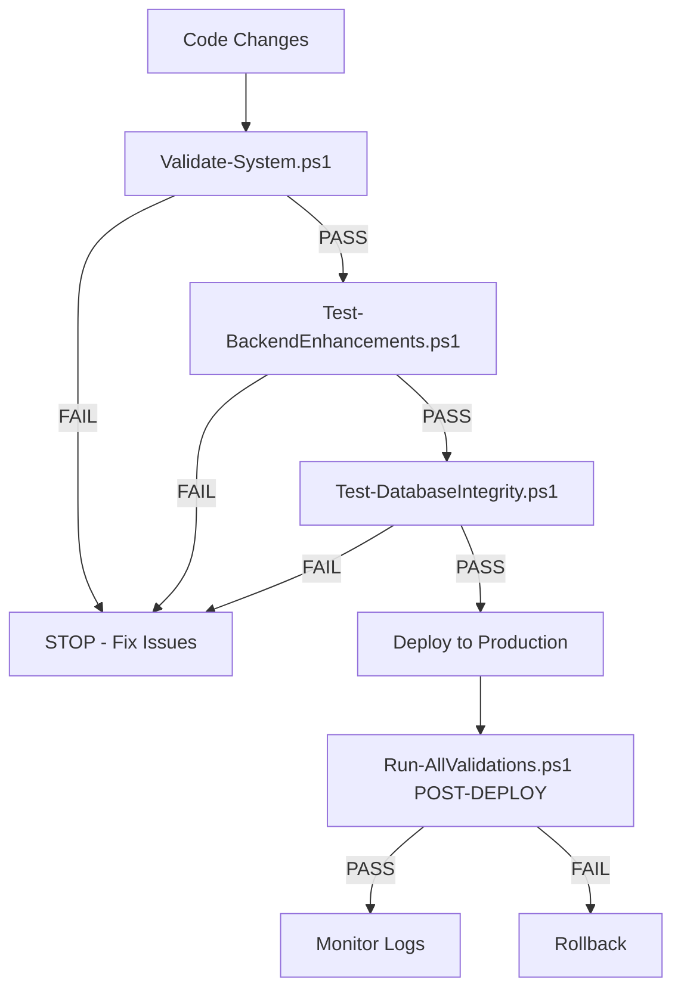

# PowerShell Validation Scripts - Complete Documentation

> **Last Updated:** 2025-01-XX  
> **System:** Home2Smart Backend + Database Validation Suite  
> **Purpose:** Comprehensive system integrity validation to prevent regressions

---

## 📋 Table of Contents

1. [Overview](#overview)
2. [Quick Start](#quick-start)
3. [Script Inventory](#script-inventory)
4. [Usage Guide](#usage-guide)
5. [Validation Workflow](#validation-workflow)
6. [Prerequisites](#prerequisites)
7. [Troubleshooting](#troubleshooting)
8. [Best Practices](#best-practices)

---

## Overview

### Purpose

This suite of PowerShell validation scripts ensures **complete system congruence** across the Home2Smart platform. They validate:

- ✅ **Frontend deployment integrity** (portal, shop domains)
- ✅ **Backend API endpoints** (all routes functional)
- ✅ **Database schema** (tables, columns, constraints)
- ✅ **Data integrity** (no empty fields, valid linkages)
- ✅ **Recent enhancements** (race condition protection, priority scoring, photo de-duplication)
- ✅ **Referential integrity** (foreign keys, orphaned records)

### When to Run

**ALWAYS run before:**
- Any production deployment
- Major code changes
- Schema migrations
- Environment variable updates
- API route modifications

**Run periodically:**
- Daily (automated CI/CD)
- After customer reports issues
- Before sprint demos

---

## Quick Start

### Minimum Viable Validation

```powershell
# Run system validation (no tokens required)
.\Validate-System.ps1
```

### Full Validation (Recommended)

```powershell
# Set environment variables
$env:H2S_ADMIN_TOKEN = "your_admin_token_here"
$env:SUPABASE_URL = "https://your-project.supabase.co"
$env:SUPABASE_SERVICE_KEY = "your_service_key_here"

# Run master orchestrator (all tests)
.\Run-AllValidations.ps1 -Verbose
```

---

## Script Inventory

### 1. `Validate-System.ps1` ⭐ **REQUIRED**

**Purpose:** Tests frontend deployment, backend API, and critical files

**Tests:**
- Frontend domains accessible (portal.home2smart.com, shop.home2smart.com)
- Backend API responding
- Database connectivity (via signup endpoint)
- Portal configuration (VERCEL_API URL correct)
- Critical files exist
- Deployment aliases correct

**Usage:**
```powershell
.\Validate-System.ps1
```

**Output:**
- Exit code 0: All critical tests passed
- Exit code 1: Critical failure (DO NOT DEPLOY)

**Runtime:** ~30 seconds

---

### 2. `Test-BackendEnhancements.ps1` (Optional)

**Purpose:** Validates recently deployed backend enhancements

**Tests:**
- **Priority Scoring:**
  - `priority_score` field exists in jobs
  - Jobs sorted by priority (DESC)
  - Scheduled jobs have score >= 1000
  - Nearby jobs have proximity bonus
  - Tie-breaker by `created_at` DESC

- **Photo De-duplication:**
  - Hash-based duplicate detection
  - 409 Conflict returned for duplicates
  - `existing_upload` details provided
  - `file_hash` stored in database

- **Race Condition Protection:**
  - Concurrent job accepts (2 pros, 10ms apart)
  - Only 1 pro succeeds, other blocked
  - "already assigned" error returned
  - No double-assignments

- **Database Schema:**
  - No empty `job_details` fields (regression guard)
  - `order_id` linkage >= 50% of jobs
  - `file_hash` field present in uploads

**Prerequisites:**
- `H2S_ADMIN_TOKEN` environment variable

**Usage:**
```powershell
$env:H2S_ADMIN_TOKEN = "your_token"
.\Test-BackendEnhancements.ps1 -Verbose
```

**Output:**
- JSON report: `backend-enhancements-report-YYYYMMDD-HHMMSS.json`
- Exit code 0: All enhancements validated
- Exit code 1: Enhancement failures detected

**Runtime:** ~2 minutes (includes concurrent requests simulation)

**WARNING:** Race condition test modifies live data (accepts a real job). Use with caution in production.

---

### 3. `Test-DatabaseIntegrity.ps1` (Optional)

**Purpose:** Direct database validation (schema, data quality, referential integrity)

**Tests:**

**Database Connectivity:**
- Supabase connection successful
- Service key valid

**Table Schema:**
- Expected tables exist:
  - `h2s_orders` (customer orders)
  - `h2s_dispatch_jobs` (technician jobs)
  - `h2s_dispatch_job_assignments` (job-to-pro assignments)
  - `job_customer_uploads` (customer photos)
  - `h2s_pros` (technician profiles)
  - `h2s_recipients` (customer records)

- Required columns present:
  - `h2s_dispatch_jobs.order_id` (critical linkage)
  - `job_customer_uploads.file_hash` (de-duplication)
  - All primary keys, timestamps

**Data Integrity:**
- No empty `job_details` fields
- `order_id` linkage rate >= 50%
- Photo uploads have `file_hash`
- Assignment states valid (pending, accepted, assigned, declined, cancelled)

**Referential Integrity:**
- Jobs with `order_id` → corresponding order exists
- Assignments → valid job exists
- Uploads → valid job exists
- No orphaned records

**Recent Data Quality:**
- Orders created in last 24h
- Jobs created in last 24h

**Prerequisites:**
- `SUPABASE_URL` environment variable
- `SUPABASE_SERVICE_KEY` environment variable

**Usage:**
```powershell
$env:SUPABASE_URL = "https://ulbzmgmxrqyipclrbohi.supabase.co"
$env:SUPABASE_SERVICE_KEY = "your_service_key"

.\Test-DatabaseIntegrity.ps1 -Verbose -ExportSchema
```

**Parameters:**
- `-Verbose`: Show detailed evidence for each test
- `-ExportSchema`: Save schema structure to JSON

**Output:**
- JSON report: `database-integrity-report-YYYYMMDD-HHMMSS.json`
- Schema export: `database-schema-export-YYYYMMDD-HHMMSS.json` (if `-ExportSchema`)
- Exit code 0: Database integrity validated
- Exit code 1: Schema/integrity issues detected

**Runtime:** ~1-2 minutes (queries sample records)

---

### 4. `Run-AllValidations.ps1` ⭐ **MASTER ORCHESTRATOR**

**Purpose:** Runs ALL validation scripts in proper sequence

**Features:**
- Checks prerequisites before running each script
- Skips optional tests if credentials missing
- Aggregates results from all scripts
- Generates master validation report
- Clear pass/fail verdict

**Usage:**
```powershell
# Set all credentials (recommended)
$env:H2S_ADMIN_TOKEN = "your_admin_token"
$env:SUPABASE_URL = "https://ulbzmgmxrqyipclrbohi.supabase.co"
$env:SUPABASE_SERVICE_KEY = "your_service_key"

# Run all validations
.\Run-AllValidations.ps1 -Verbose
```

**Parameters:**
- `-Verbose`: Show detailed output from each script
- `-SkipDestructive`: Skip tests that modify data (e.g., race condition test)
- `-AdminToken`: Override admin token
- `-SupabaseUrl`: Override Supabase URL
- `-SupabaseKey`: Override Supabase service key

**Output:**
```
╔════════════════════════════════════════════════════════════════╗
║  VALIDATION SUMMARY                                            ║
╚════════════════════════════════════════════════════════════════╝

  Results:
    ✅ Passed:   3
    ❌ Failed:   0
    ⏭️  Skipped:  0
    ❗ Errors:   0

  Critical Tests (Required):
    Passed: 1
    Failed: 0

  Detailed Results:
    ✅ System Validation (Frontend/Portal)          [REQUIRED]
       Duration: 28.4s
    ✅ Backend Enhancements                        [OPTIONAL]
       Duration: 114.2s
    ✅ Database Integrity                          [OPTIONAL]
       Duration: 67.8s

  📄 Full report saved to: .\master-validation-report-20250120-143055.json

╔════════════════════════════════════════════════════════════════╗
║  FINAL VERDICT                                                 ║
╚════════════════════════════════════════════════════════════════╝

  🎉 SUCCESS! ALL VALIDATIONS PASSED
  System is healthy and ready for deployment
```

**Exit Codes:**
- `0`: All required tests passed (safe to deploy)
- `1`: Required tests failed (DO NOT DEPLOY)

**Runtime:** ~3-5 minutes (runs all scripts sequentially)

---

## Usage Guide

### Scenario 1: Pre-Deployment Validation

**Workflow:**
```powershell
# 1. Set credentials
$env:H2S_ADMIN_TOKEN = "your_admin_token"

# 2. Run quick system check
.\Validate-System.ps1

# 3. If passed, run full validation
.\Run-AllValidations.ps1

# 4. Review report
# If exit code 0 → Deploy
# If exit code 1 → Fix issues, re-run
```

---

### Scenario 2: Daily Health Check

**Automated:**
```powershell
# Add to Windows Task Scheduler or CI/CD pipeline
.\Run-AllValidations.ps1 -Verbose | Out-File -FilePath ".\validation-$(Get-Date -Format 'yyyyMMdd').log"

# Send email if exit code 1
if ($LASTEXITCODE -ne 0) {
    Send-MailMessage -To "dev@home2smart.com" -Subject "Validation Failed" -Body "See attached log"
}
```

---

### Scenario 3: Debugging Production Issue

**Targeted Testing:**
```powershell
# Test specific enhancement
.\Test-BackendEnhancements.ps1 -Verbose

# Review JSON report for detailed evidence
Get-Content .\backend-enhancements-report-*.json | ConvertFrom-Json | Format-List

# Test database schema
.\Test-DatabaseIntegrity.ps1 -ExportSchema

# Compare exported schema to expected
```

---

### Scenario 4: Post-Migration Validation

**After database changes:**
```powershell
# 1. Export schema BEFORE migration
.\Test-DatabaseIntegrity.ps1 -ExportSchema

# 2. Run migration

# 3. Export schema AFTER migration
.\Test-DatabaseIntegrity.ps1 -ExportSchema

# 4. Compare schemas
$before = Get-Content .\database-schema-export-BEFORE.json | ConvertFrom-Json
$after = Get-Content .\database-schema-export-AFTER.json | ConvertFrom-Json

# 5. Validate integrity
.\Test-DatabaseIntegrity.ps1 -Verbose
```

---

## Validation Workflow

### Recommended Sequence



### CI/CD Integration

**GitHub Actions Example:**
```yaml
name: Validation Suite

on: [push, pull_request]

jobs:
  validate:
    runs-on: windows-latest
    steps:
      - uses: actions/checkout@v2
      
      - name: Run System Validation
        shell: pwsh
        run: |
          .\Validate-System.ps1
      
      - name: Run Backend Enhancements Tests
        shell: pwsh
        env:
          H2S_ADMIN_TOKEN: ${{ secrets.H2S_ADMIN_TOKEN }}
        run: |
          .\Test-BackendEnhancements.ps1
      
      - name: Run Database Integrity Tests
        shell: pwsh
        env:
          SUPABASE_URL: ${{ secrets.SUPABASE_URL }}
          SUPABASE_SERVICE_KEY: ${{ secrets.SUPABASE_SERVICE_KEY }}
        run: |
          .\Test-DatabaseIntegrity.ps1
      
      - name: Upload Reports
        uses: actions/upload-artifact@v2
        with:
          name: validation-reports
          path: |
            *-report-*.json
```

---

## Prerequisites

### Required for All Scripts

- **PowerShell 7+** (Windows, macOS, Linux)
- **Internet connection** (API requests)
- **Workspace:** `c:\Users\tabar\h2s-bundles-workspace`

### Optional (for full validation)

#### H2S_ADMIN_TOKEN

**Purpose:** Authenticates backend API requests (portal jobs, admin dispatch)

**How to obtain:**
1. Sign up as pro via portal: https://portal.home2smart.com
2. Complete signup flow
3. Token returned in API response (`pro_token`)
4. Store in environment variable:
   ```powershell
   $env:H2S_ADMIN_TOKEN = "your_token_here"
   ```

**Used by:**
- `Test-BackendEnhancements.ps1`
- `Run-AllValidations.ps1` (optional tests)

---

#### SUPABASE_URL

**Purpose:** Direct database queries for schema validation

**Value:** `https://ulbzmgmxrqyipclrbohi.supabase.co`

**How to set:**
```powershell
$env:SUPABASE_URL = "https://ulbzmgmxrqyipclrbohi.supabase.co"
```

**Used by:**
- `Test-DatabaseIntegrity.ps1`
- `Run-AllValidations.ps1` (database tests)

---

#### SUPABASE_SERVICE_KEY

**Purpose:** Service role key (bypasses RLS for admin queries)

**How to obtain:**
1. Supabase Dashboard → Settings → API
2. Copy "service_role" key (NOT "anon" key)
3. Store securely:
   ```powershell
   $env:SUPABASE_SERVICE_KEY = "eyJhbG..."
   ```

**Security:** NEVER commit this to Git. Use environment variables or secrets manager.

**Used by:**
- `Test-DatabaseIntegrity.ps1`
- `Run-AllValidations.ps1` (database tests)

---

## Troubleshooting

### Common Issues

#### 1. "Script not found"

**Error:**
```
ERROR: Script not found: .\Test-BackendEnhancements.ps1
```

**Solution:**
```powershell
# Ensure you're in the correct directory
cd C:\Users\tabar\h2s-bundles-workspace

# List available scripts
Get-ChildItem -Filter "*.ps1"
```

---

#### 2. "Execution policy restricted"

**Error:**
```
.\Validate-System.ps1 : File cannot be loaded because running scripts is disabled on this system.
```

**Solution:**
```powershell
# Check current policy
Get-ExecutionPolicy

# Set to RemoteSigned (allows local scripts)
Set-ExecutionPolicy RemoteSigned -Scope CurrentUser

# Or run once with bypass
powershell -ExecutionPolicy Bypass -File .\Validate-System.ps1
```

---

#### 3. "H2S_ADMIN_TOKEN required"

**Error:**
```
⚠️  WARNING: H2S_ADMIN_TOKEN not provided!
Some tests will be skipped.
```

**Solution:**
```powershell
# Set token
$env:H2S_ADMIN_TOKEN = "your_token"

# Verify
$env:H2S_ADMIN_TOKEN
```

---

#### 4. "Portal domain failed"

**Error:**
```
❌ Portal domain failed: The remote name could not be resolved: 'portal.home2smart.com'
```

**Possible causes:**
- DNS not propagated
- Vercel alias not set
- Domain expired

**Solution:**
```powershell
# Check DNS
nslookup portal.home2smart.com

# Check Vercel aliases
cd frontend
vercel alias ls

# Re-link alias if needed
vercel alias set <deployment-url> portal.home2smart.com
```

---

#### 5. "Database connection failed"

**Error:**
```
❌ Database connection: Unauthorized
```

**Possible causes:**
- Wrong `SUPABASE_SERVICE_KEY`
- Key has spaces/newlines
- Wrong Supabase project

**Solution:**
```powershell
# Verify URL
$env:SUPABASE_URL
# Should be: https://ulbzmgmxrqyipclrbohi.supabase.co

# Verify key (check for whitespace)
$env:SUPABASE_SERVICE_KEY.Trim().Length
# Should be ~200 characters

# Re-set without spaces
$env:SUPABASE_SERVICE_KEY = "eyJhbG..."
```

---

#### 6. "Race condition test failed - both pros accepted"

**Error:**
```
❌ CRITICAL: Double-accept prevented
   BOTH pros accepted same job - race condition NOT prevented!
```

**Possible causes:**
- Race condition protection not deployed
- Caching issue (old code served)
- Logic error in dispatchOfferAssignment.ts

**Solution:**
```powershell
# 1. Verify deployment
cd backend
vercel ls

# 2. Check production alias
vercel alias ls

# 3. Re-deploy
vercel --prod --yes

# 4. Re-run test
.\Test-BackendEnhancements.ps1
```

---

#### 7. "Priority score field not found"

**Error:**
```
❌ priority_score field exists
   Found in job objects: False
```

**Possible causes:**
- Priority scoring not deployed
- Wrong backend URL in `portal_jobs/route.ts`
- Old code cached

**Solution:**
```powershell
# Check deployed code
cd backend/app/api/portal_jobs
cat route.ts | Select-String "priority_score"

# Should see calculatePriorityScore() function

# If missing, deploy
cd ../../../..
vercel --prod --yes
```

---

## Best Practices

### 1. Run Before Every Deployment

**Rule:** Never deploy without green validation

```powershell
# Pre-deployment checklist
.\Run-AllValidations.ps1
if ($LASTEXITCODE -eq 0) {
    Write-Host "✅ Safe to deploy"
    # Deploy commands here
} else {
    Write-Host "❌ Fix issues before deploying"
    exit 1
}
```

---

### 2. Store Credentials Securely

**DO:**
```powershell
# Use environment variables
$env:H2S_ADMIN_TOKEN = Get-Content .\.secrets\admin-token.txt

# Or Windows Credential Manager
Install-Module -Name CredentialManager
$cred = Get-StoredCredential -Target "H2S_Admin"
$env:H2S_ADMIN_TOKEN = $cred.GetNetworkCredential().Password
```

**DON'T:**
```powershell
# Hard-code in scripts
$token = "abc123..."  # ❌ NEVER DO THIS

# Commit to Git
git add .env  # ❌ NEVER COMMIT SECRETS
```

---

### 3. Review JSON Reports

**Every test generates detailed JSON:**
```powershell
# View latest report
Get-Content .\*-report-*.json -Tail 1 | ConvertFrom-Json | Format-List

# Filter failures
$report = Get-Content .\backend-enhancements-report-20250120-143055.json | ConvertFrom-Json
$report | Where-Object { !$_.Passed }

# Export to CSV for tracking
$report | Export-Csv -Path .\validation-history.csv -Append
```

---

### 4. Automate Daily Validation

**Windows Task Scheduler:**
```powershell
# Create scheduled task
$action = New-ScheduledTaskAction -Execute "powershell.exe" -Argument "-File C:\Users\tabar\h2s-bundles-workspace\Run-AllValidations.ps1"
$trigger = New-ScheduledTaskTrigger -Daily -At 6am
Register-ScheduledTask -TaskName "H2S Daily Validation" -Action $action -Trigger $trigger
```

---

### 5. Version Control Reports

**Keep history of validations:**
```powershell
# Create reports directory
mkdir .\validation-reports

# Move reports after each run
Move-Item -Path .\*-report-*.json -Destination .\validation-reports\

# Track in Git
git add validation-reports/
git commit -m "Validation reports - $(Get-Date -Format 'yyyy-MM-dd')"
```

---

### 6. Monitor Trends

**Track pass rates over time:**
```powershell
# Parse all historical reports
$reports = Get-ChildItem .\validation-reports\*-report-*.json | ForEach-Object {
    $data = Get-Content $_.FullName | ConvertFrom-Json
    [PSCustomObject]@{
        Date = $_.BaseName -replace '.*-(\d{8})-.*','$1'
        PassRate = ($data | Where-Object { $_.Passed }).Count / $data.Count * 100
        FailureCount = ($data | Where-Object { !$_.Passed }).Count
    }
}

# Chart trend
$reports | Sort-Object Date | Format-Table -AutoSize
```

---

## Summary

### Critical Files

| Script | Purpose | Required | Runtime |
|--------|---------|----------|---------|
| `Validate-System.ps1` | Frontend/backend health | ✅ Yes | ~30s |
| `Test-BackendEnhancements.ps1` | Recent enhancements | ❌ No | ~2m |
| `Test-DatabaseIntegrity.ps1` | Database schema/integrity | ❌ No | ~1m |
| `Run-AllValidations.ps1` | Master orchestrator | ✅ Yes | ~5m |

### Quick Reference

```powershell
# Minimum validation (no credentials)
.\Validate-System.ps1

# Full validation (with credentials)
$env:H2S_ADMIN_TOKEN = "token"
$env:SUPABASE_URL = "https://ulbzmgmxrqyipclrbohi.supabase.co"
$env:SUPABASE_SERVICE_KEY = "key"
.\Run-AllValidations.ps1 -Verbose

# Pre-deployment check
.\Run-AllValidations.ps1 && Write-Host "✅ Safe to deploy"
```

---

**Last Verified:** 2025-01-20  
**Backend Version:** backend-i9hyyxxp5  
**Tested Enhancements:** Race protection, priority scoring, photo de-duplication
